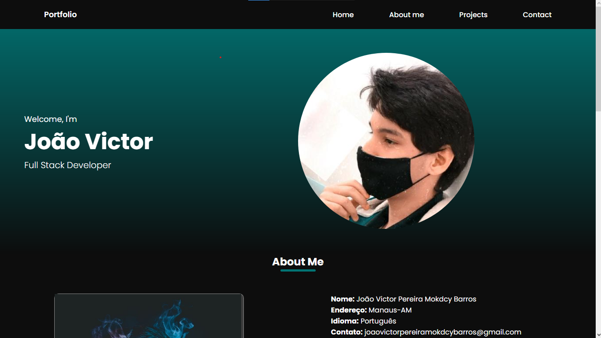

# PortFolio

## 📄 Goal:

this is my portfolio, where I present all my skills and individualities, here you will know a little of me

## 🔧 Function
- [X] show my skills
- [X] develop an insight into my person
- [X] creating a simple website
## 🙋‍♂️ Authors:
<table>
  <tr>
    <td align="center">
      <a href="#">
         
        
          <b>João Mokdcy</b>
        
      </a>
    </td>
